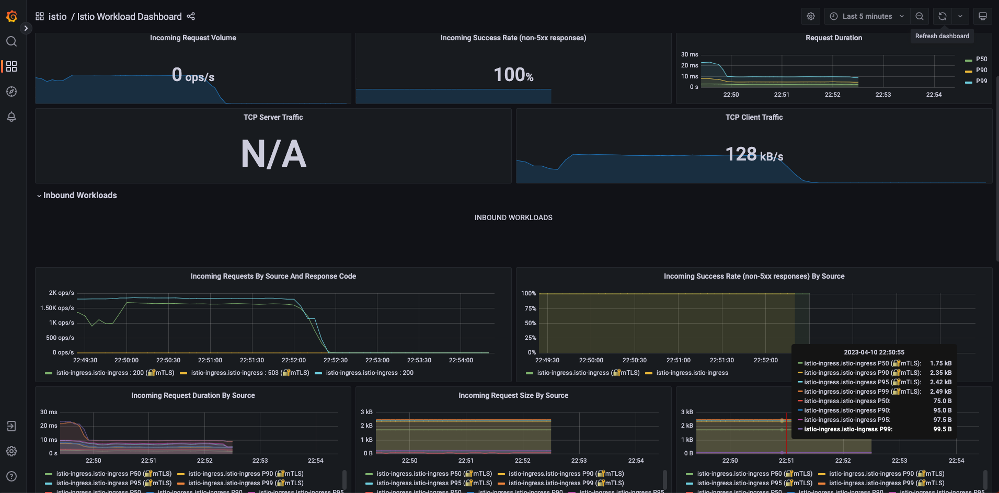
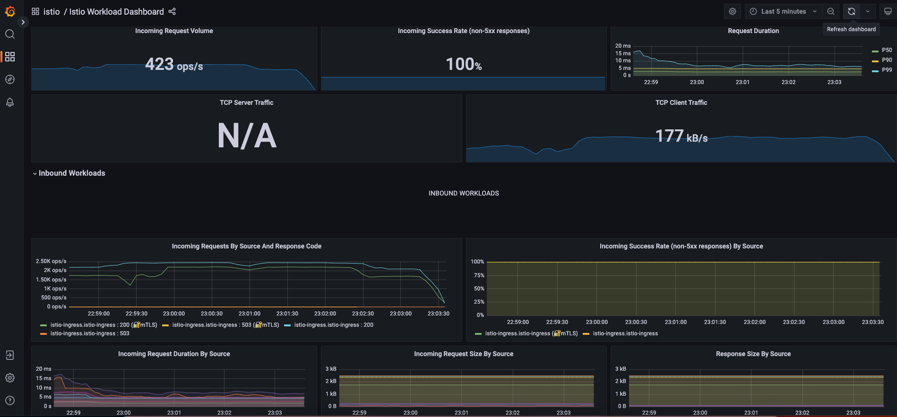

# Lab 5 Findings - Victor Ramirez

- [Lab 5 Findings - \Victor Ramirez]]
  - [Introduction](#introduction)
  - [Findings](#findings)
    - [Finding 1](#finding-1)
    - [Finding 2](#finding-2)
    - [Finding 3](#finding-3)
  - [Conclusion](#conclusion)

---

## Introduction

Lab 5, we had to perform a performance testing on our Lab 4 application deployed on Azure Kubernetes Service (AKS). We use to provided K6, an open source load testing tool, that will simulate traffic to our /predict endpoint and captured metrics from the istio proxy sidecars using Prometheus Time Series Database (TSDB). We then visualized the metrics using Grafana, which provides prebuilt istio dashboards for our workloads / services. ALso please see the captured screenshots of the Grafana dashboard as evidence for our findings.

## Findings

[Performance Metrics Analysis]  
Perofrmance testing metrics captured:
Response time: The average time taken by the endpoint to respond to each request.
Throughput: The number of requests processed per second by the endpoint.
Error rate: The percentage of requests that resulted in errors.

### Finding 1

[Response Time]  
The response time of our /predict endpoint varied based on the CACHE_RATE value used in the K6 script. When CACHE_RATE was set to 0, indicating no caching, the response time was higher compared to when CACHE_RATE was set to 1, indicating full caching. This is expected as caching can significantly improve response time by serving cached results instead of processing the request.  

  

### Finding 2

[Throughput]  
The throughput of our /predict endpoint was also influenced by the CACHE_RATE value. With higher caching (CACHE_RATE=1), the throughput was higher compared to no caching (CACHE_RATE=0). This is because caching reduces the load on the application by serving cached results, allowing it to handle more requests per second.  
  

### Finding 3

[Error Rate]  
We also observed a difference in the error rate of our /predict endpoint based on the CACHE_RATE value. With higher caching (CACHE_RATE=1), the error rate was lower compared to no caching (CACHE_RATE=0). This is expected as caching can improve the performance and reliability of the endpoint by serving cached results and reducing the load on the application.  
  

### Conclusion

[Conclusion] 

In conclusion, our performance testing using K6, Prometheus, and Grafana has provided valuable insights into the impact of caching on the performance of our /predict endpoint. Higher caching (CACHE_RATE=1) resulted in improved response time, higher throughput, and lower error rate compared to no caching (CACHE_RATE=0). The Grafana dashboard screenshots provided visual representation of the performance metrics captured, allowing us to monitor and optimize our application's performance on AKS. Overall, caching has shown to be beneficial in enhancing the performance and reliability of our application.
